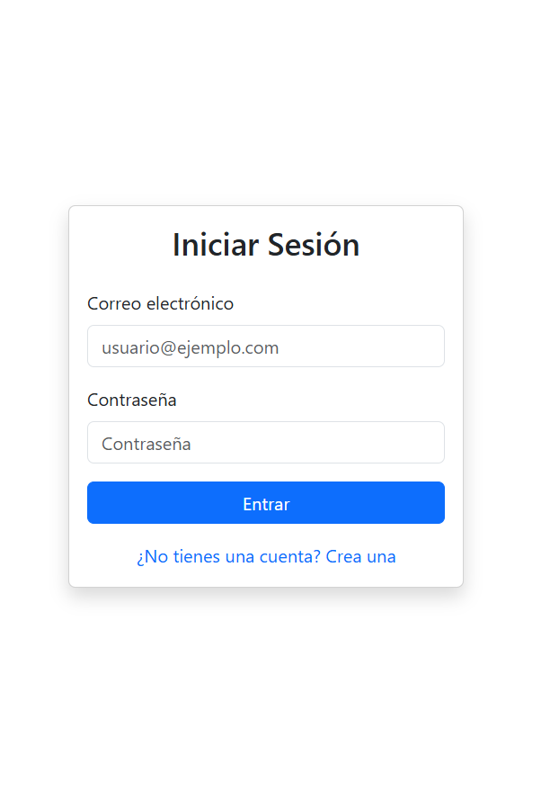
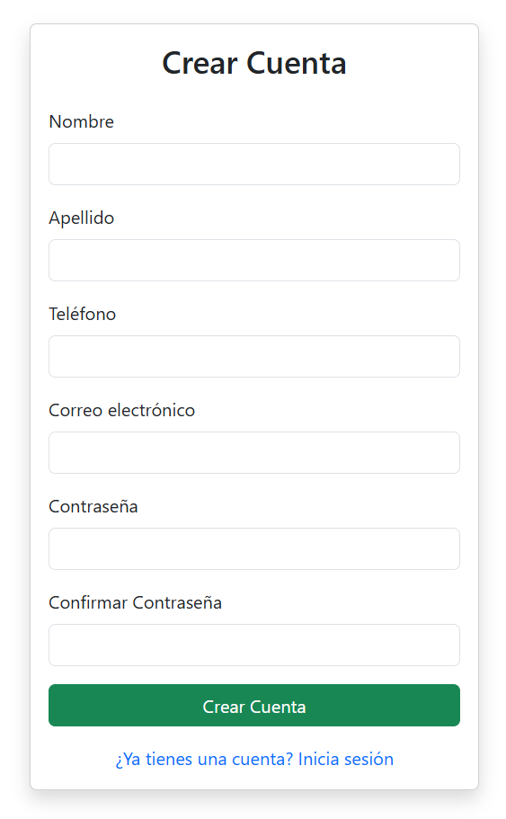
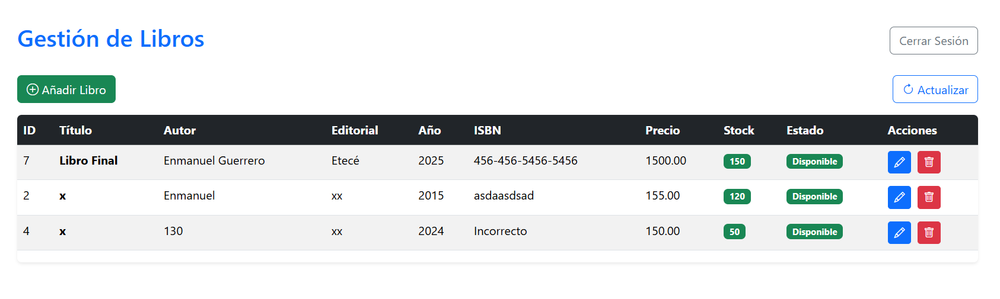
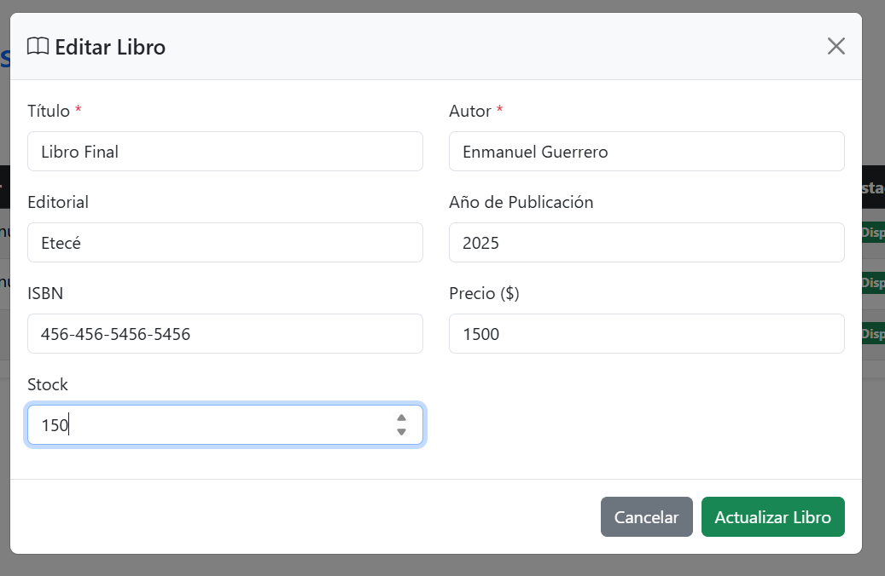
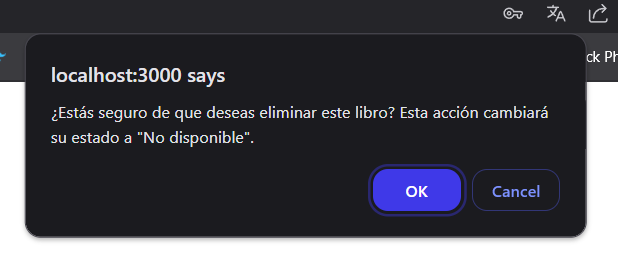
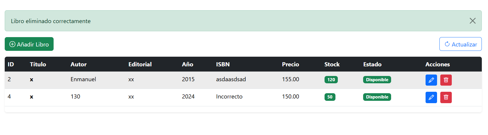
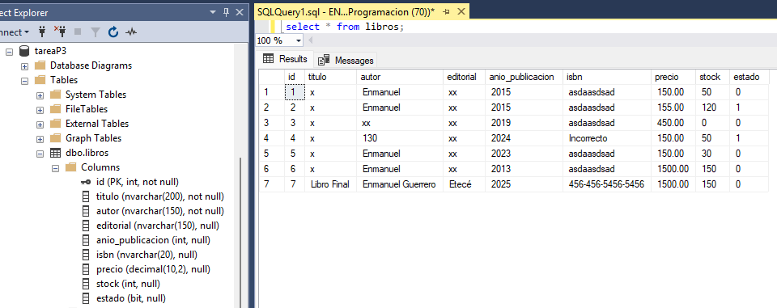

# Tarea de manejo de versiones Git

Enmanuel Guerrero Santana (2024-0275),

# Login

# Crear cuenta

# Dashboard Principal

# Modal añadir libro

# Modal editar libro

# Eliminar libro

Para eliminar Libro Final

Registro eliminado

# Base de datos

Tabla Libros

Tabla usuarios

